# HireDesk

[](https://github.com/Ajmal-x/hiredesk-mern/actions/workflows/ci.yml)
[](LICENSE)


**HireDesk** is a modern full-stack job platform and applicant tracking system built with the MERN stack and TypeScript.

Candidates can discover jobs, filter and search listings, save jobs, apply with a resume, track applications, and manage their profiles. Recruiters can publish and manage jobs, review applicants, download resumes, manage hiring stages, and monitor recruitment activity from a dedicated dashboard.

The project was designed as a complete full-stack application with a focus on clean architecture, responsive UI, role-based access control, reliable API design, and a professional hiring workflow.

---

## ✨ Features

### For Candidates

* Browse and search available jobs
* Search by keyword and filter by:

  * Location
  * Job type
  * Work mode
  * Salary
  * Skills
* View detailed job information
* Save and unsave jobs
* Apply to jobs with:

  * PDF
  * DOC
  * DOCX
* Add an optional cover letter
* Upload and manage a profile resume
* Track submitted applications
* View application status and history
* Withdraw applications when allowed
* Candidate dashboard with application statistics
* Receive application-related notifications
* Mark notifications as read
* Delete notifications

### For Recruiters

* Recruiter dashboard
* Create new job listings
* Edit existing jobs
* Open and close job listings
* Delete job listings
* View applicant counts
* Review applicants for each job
* View candidate information
* Read cover letters
* Download candidate resumes
* Move applicants through hiring stages
* Reject applications
* Monitor recruitment statistics
* Receive new-application notifications

### Roles

HireDesk supports three roles:

* `candidate`
* `recruiter`
* `admin`

Role-based permissions are enforced on the server.

---

## 🛠️ Tech Stack

### Frontend

* React
* TypeScript
* Vite
* Tailwind CSS
* React Router
* TanStack Query
* Axios
* Lucide React

### Backend

* Node.js
* Express
* TypeScript
* MongoDB
* Mongoose
* Zod
* JWT authentication
* Multer
* Helmet
* CORS
* Express Rate Limit
* Morgan

### Development & Testing

* Vitest
* Supertest
* MongoDB Memory Server
* GitHub Actions
* Docker

---

## 📸 Screenshots

### Home & Job Search

| Home                                  | Job Search                                  |
| ------------------------------------- | ------------------------------------------- |
| 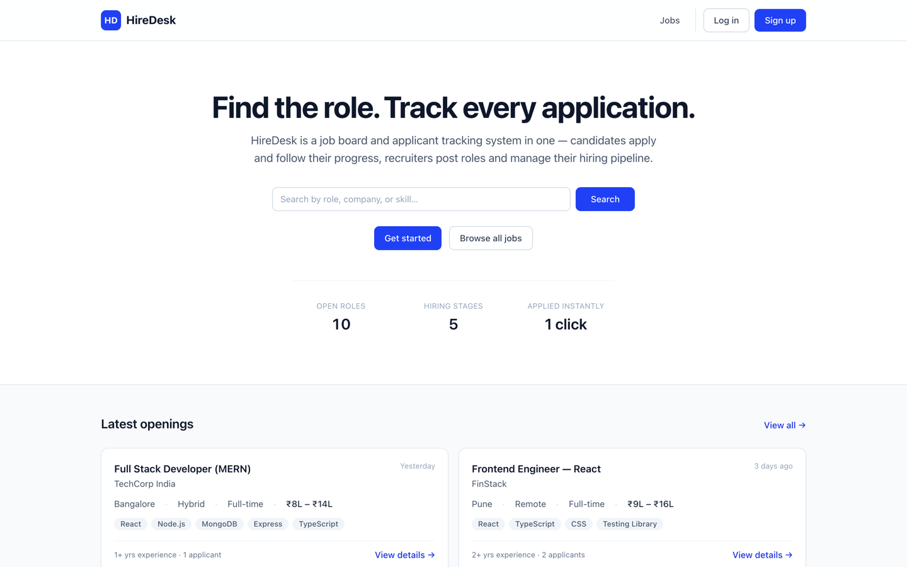 | 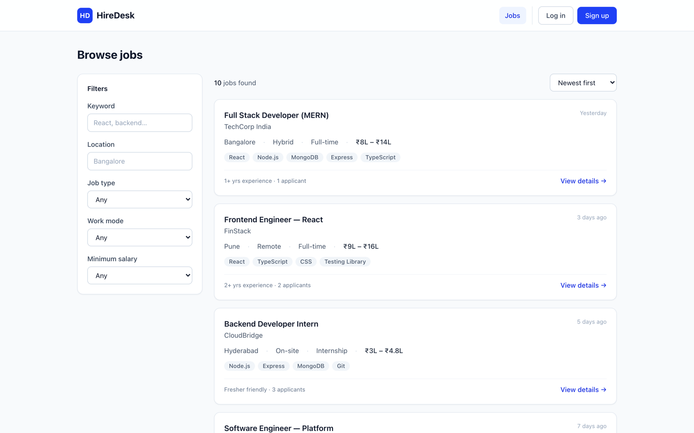 |

### Job Search & Job Details

| Filtered Jobs                                           | Job Details                                        |
| ------------------------------------------------------- | -------------------------------------------------- |
| 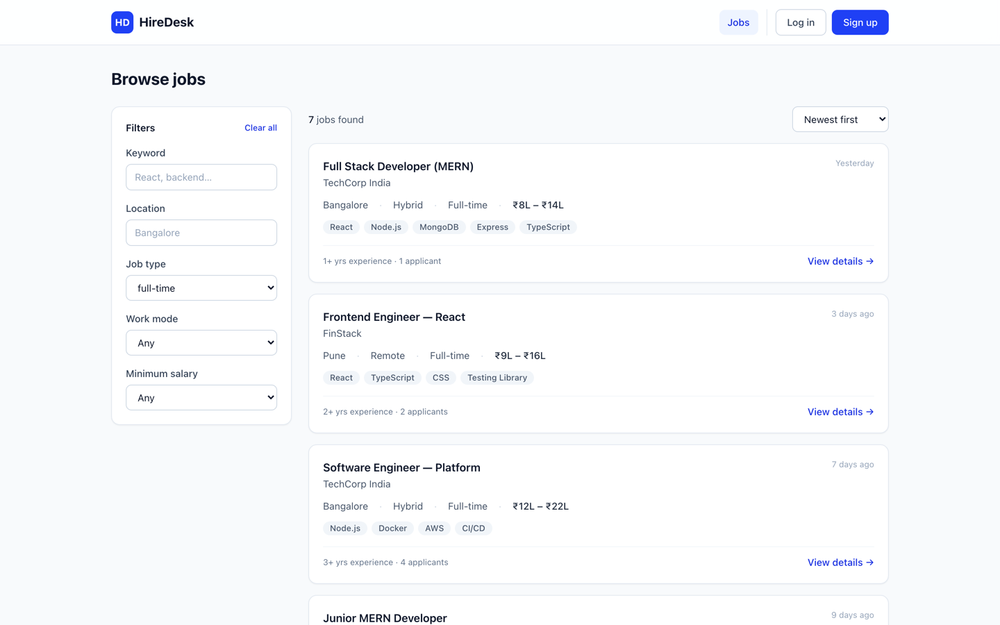 | 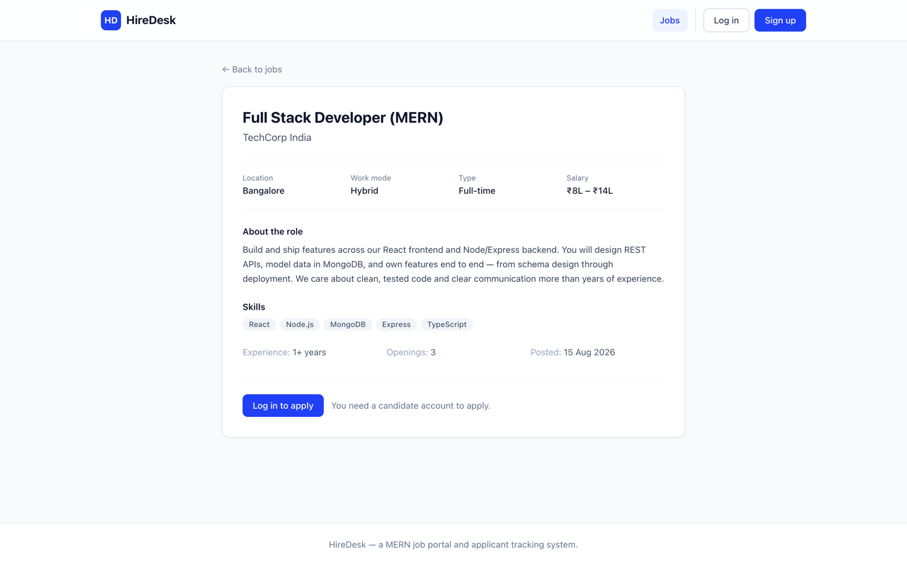 |

### Candidate Experience

| Candidate Dashboard                                                 | My Applications                                             |
| ------------------------------------------------------------------- | ----------------------------------------------------------- |
| 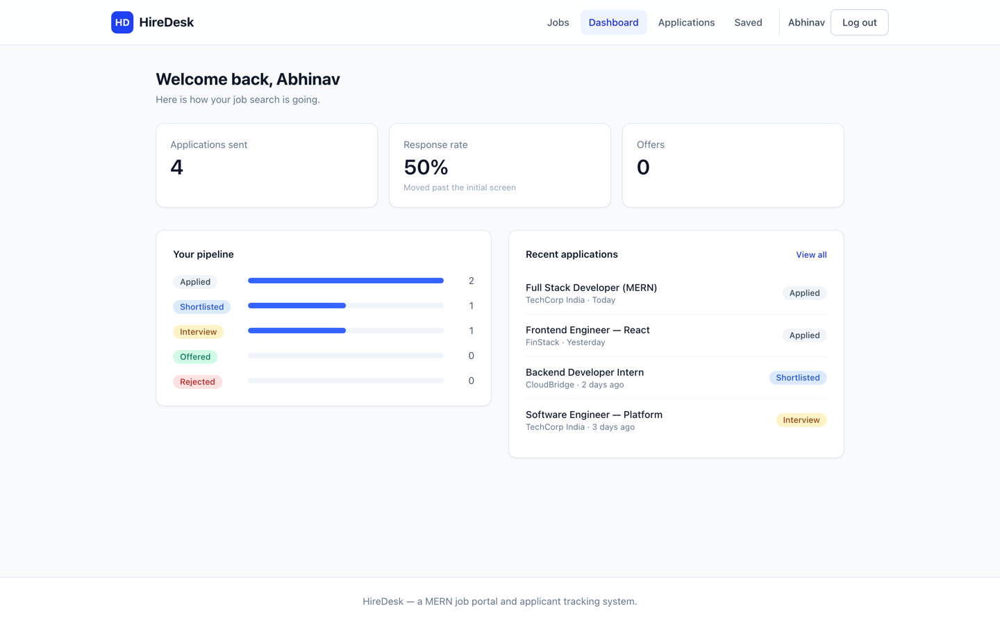 | 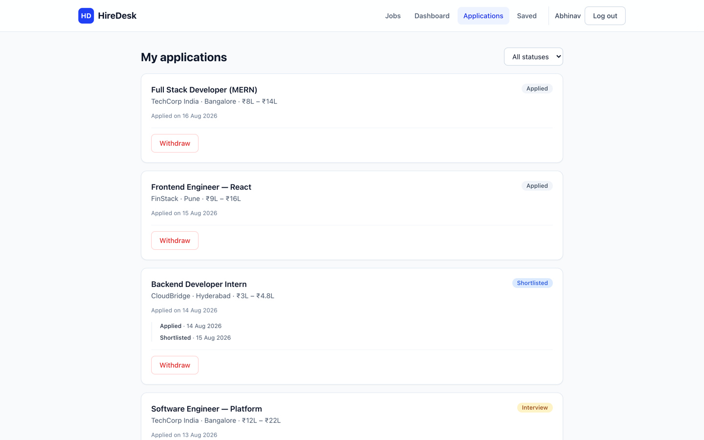 |

### Recruiter Experience

| Recruiter Dashboard                                                 | Recruiter Jobs                                            |
| ------------------------------------------------------------------- | --------------------------------------------------------- |
| 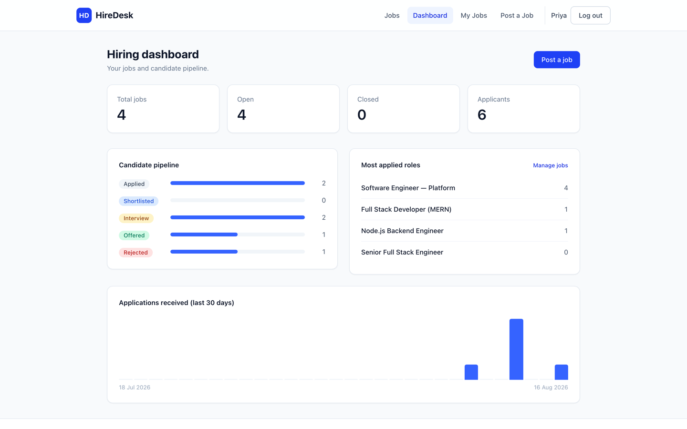 | 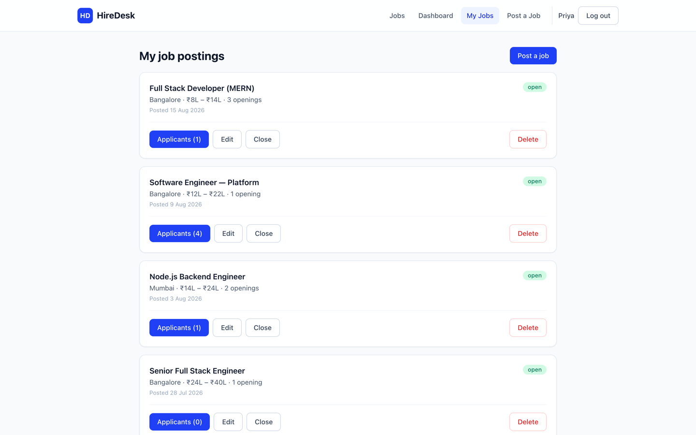 |

### Applicant Management

| Applicants                                        | Post a Job                                      |
| ------------------------------------------------- | ----------------------------------------------- |
| 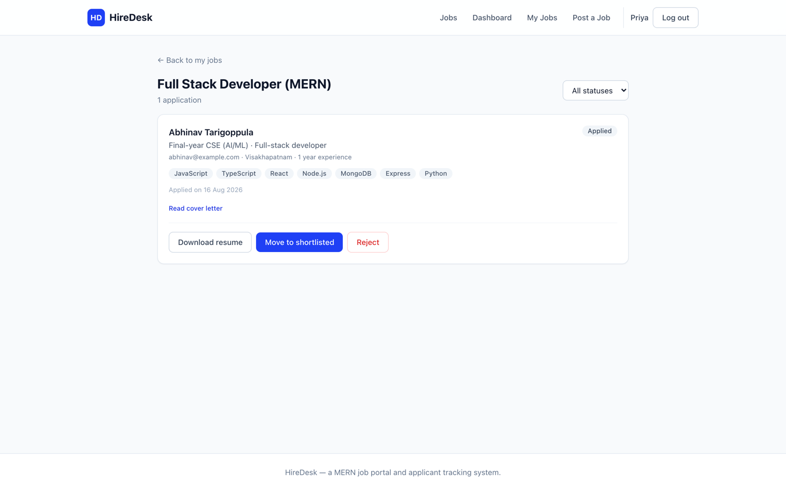 | 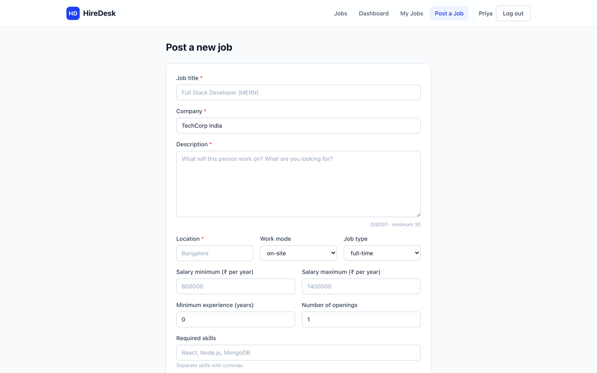 |

### Mobile

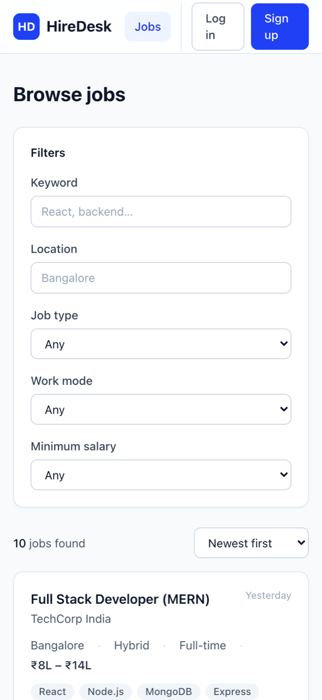

---

## 🏗️ Architecture

```text
┌─────────────────────────────────────────────────────────────┐
│                    React + TypeScript                       │
│                    Vite + Tailwind CSS                      │
│                                                             │
│  React Router · TanStack Query · AuthContext                │
│  Job Search · Applications · Dashboard · Notifications      │
└────────────────────────────┬────────────────────────────────┘
                             │
                             │ REST API
                             │
┌────────────────────────────▼────────────────────────────────┐
│                 Express + TypeScript API                    │
│                                                             │
│  Authentication · RBAC · Validation · Uploads              │
│  Controllers · Routes · Error Handling · Rate Limiting      │
└────────────────────────────┬────────────────────────────────┘
                             │
                             │ Mongoose
                             │
┌────────────────────────────▼────────────────────────────────┐
│                         MongoDB                              │
│                                                             │
│ Users · Jobs · Applications · Saved Jobs · Notifications    │
└─────────────────────────────────────────────────────────────┘
```

---

## 📁 Project Structure

```text
hiredesk-mern/
│
├── client/
│   ├── src/
│   │   ├── components/
│   │   ├── context/
│   │   ├── hooks/
│   │   ├── lib/
│   │   ├── pages/
│   │   ├── types.ts
│   │   ├── App.tsx
│   │   ├── index.css
│   │   └── main.tsx
│   ├── package.json
│   ├── tailwind.config.js
│   ├── tsconfig.json
│   └── vite.config.ts
│
├── server/
│   ├── src/
│   │   ├── config/
│   │   ├── controllers/
│   │   ├── middleware/
│   │   ├── models/
│   │   ├── routes/
│   │   ├── utils/
│   │   ├── validators/
│   │   ├── app.ts
│   │   └── index.ts
│   ├── tests/
│   ├── .env.example
│   ├── package.json
│   └── tsconfig.json
│
├── docs/
│   └── screenshots/
│
├── .github/
│   └── workflows/
│
├── docker-compose.yml
├── package.json
├── package-lock.json
└── README.md
```

---

## 🚀 Running Locally

### Prerequisites

* Node.js 20+
* MongoDB Atlas or a local MongoDB instance
* Git

### 1. Clone the repository

```bash
git clone https://github.com/Ajmal-x/hiredesk-mern.git
cd hiredesk-mern
```

### 2. Install dependencies

```bash
npm install
```

### 3. Configure environment variables

Create:

```text
server/.env
```

Use the provided example:

```bash
cp server/.env.example server/.env
```

Then configure your MongoDB connection and authentication secrets.

### 4. Start the development environment

```bash
npm run dev
```

The application runs on:

```text
Frontend: http://localhost:5173
Backend:  http://localhost:4000
```

---

## 🔐 Environment Variables

Server configuration is stored in:

```text
server/.env
```

Example:

```env
NODE_ENV=development
PORT=4000

MONGODB_URI=your_mongodb_connection_string

JWT_SECRET=your_secret

CLIENT_ORIGIN=http://localhost:5173

MAX_UPLOAD_MB=5
```

**Never commit your real `.env` file.**

The repository already ignores:

```text
.env
.env.local
```

---

## 👤 Demo Accounts

The project includes demo accounts for testing the main user flows.

### Candidate

```text
Email: candidate@hiredesk.demo
```

### Recruiter

```text
Email: recruiter@hiredesk.demo
```

The demo environment can also be populated with sample jobs using the project's seed scripts.

> Demo credentials should only be used for local development and testing.

---

## 💼 Job Management

Recruiters can manage the complete job lifecycle:

```text
Create
  ↓
Open
  ↓
Edit
  ↓
Close
  ↓
Reopen
  ↓
Delete
```

Each job supports:

* Job title
* Company
* Description
* Location
* Work mode
* Job type
* Skills
* Salary range
* Minimum experience
* Number of openings
* Application count
* Job status

Salaries are represented in **USD** throughout the application.

---

## 📄 Applications

The application workflow is:

```text
Candidate
    │
    ▼
Apply to Job
    │
    ▼
Application Created
    │
    ▼
Applied
    │
    ▼
Shortlisted
    │
    ▼
Interview
    │
    ▼
Offered
```

An application can also be rejected from the appropriate stages.

Applications include:

* Candidate
* Job
* Resume
* Cover letter
* Current status
* Status history
* Creation date
* Last update

Duplicate applications are prevented at the database level.

---

## 🔔 Notifications

HireDesk includes a lightweight notification system.

Currently supported notifications include:

* New application notifications for recruiters

Users can:

* View notifications
* See unread count
* Mark individual notifications as read
* Mark all notifications as read
* Delete notifications
* Navigate directly to the related page

Notifications are stored in MongoDB and refreshed periodically on the client.

---

## 📊 Dashboards

### Candidate Dashboard

Provides:

* Total applications
* Application pipeline
* Recent applications
* Application activity
* Quick access to jobs

### Recruiter Dashboard

Provides:

* Total jobs
* Open jobs
* Total applicants
* Application pipeline
* Most-applied roles
* Recent application activity
* Recruitment statistics

---

## 📌 Saved Jobs

Candidates can save interesting jobs and access them later from:

```text
/saved
```

Saved jobs are stored separately from applications, allowing candidates to bookmark jobs without applying.

---

## 📎 Resume Management

Candidates can upload resumes from their profile.

Supported formats:

```text
PDF
DOC
DOCX
```

The default maximum upload size is:

```text
5 MB
```

Recruiters can download resumes attached to applications.

Uploaded files are stored in the server's uploads directory during local development.

For production deployments, object storage such as S3 or Cloudinary is recommended.

---

## 🔌 API Overview

Base API:

```text
/api
```

### Authentication

| Method | Endpoint          | Access | Description           |
| ------ | ----------------- | ------ | --------------------- |
| POST   | `/auth/register`  | Public | Register              |
| POST   | `/auth/login`     | Public | Login                 |
| POST   | `/auth/refresh`   | Auth   | Refresh access token  |
| POST   | `/auth/logout`    | Auth   | Logout                |
| GET    | `/auth/me`        | Auth   | Current user          |
| PATCH  | `/auth/me`        | Auth   | Update profile        |
| PATCH  | `/auth/me/resume` | Auth   | Upload profile resume |
| DELETE | `/auth/me/resume` | Auth   | Delete profile resume |

### Jobs

| Method | Endpoint         | Access          | Description          |
| ------ | ---------------- | --------------- | -------------------- |
| GET    | `/jobs`          | Public          | Search and list jobs |
| GET    | `/jobs/:id`      | Public          | Job details          |
| GET    | `/jobs/mine`     | Recruiter/Admin | Recruiter's jobs     |
| GET    | `/jobs/saved`    | Auth            | Saved jobs           |
| POST   | `/jobs`          | Recruiter/Admin | Create job           |
| PATCH  | `/jobs/:id`      | Owner/Admin     | Update job           |
| DELETE | `/jobs/:id`      | Owner/Admin     | Delete job           |
| POST   | `/jobs/:id/save` | Auth            | Save job             |
| DELETE | `/jobs/:id/save` | Auth            | Unsave job           |

### Applications

| Method | Endpoint                   | Access          | Description     |
| ------ | -------------------------- | --------------- | --------------- |
| POST   | `/jobs/:id/apply`          | Candidate       | Apply to job    |
| GET    | `/jobs/:id/applications`   | Owner/Admin     | View applicants |
| GET    | `/applications/mine`       | Candidate       | My applications |
| PATCH  | `/applications/:id/status` | Owner/Admin     | Update status   |
| GET    | `/applications/:id/resume` | Owner/Applicant | Resume          |
| DELETE | `/applications/:id`        | Applicant       | Withdraw        |

### Notifications

| Method | Endpoint                  | Access | Description         |
| ------ | ------------------------- | ------ | ------------------- |
| GET    | `/notifications`          | Auth   | List notifications  |
| PATCH  | `/notifications/:id/read` | Auth   | Mark as read        |
| PATCH  | `/notifications/read-all` | Auth   | Mark all as read    |
| DELETE | `/notifications/:id`      | Auth   | Delete notification |

### Statistics

| Method | Endpoint           | Access    | Description             |
| ------ | ------------------ | --------- | ----------------------- |
| GET    | `/stats/candidate` | Candidate | Candidate statistics    |
| GET    | `/stats/recruiter` | Recruiter | Recruiter statistics    |
| GET    | `/health`          | Public    | API and database health |

---

## 🧩 Data Model

The main MongoDB collections are:

```text
User
 ├── candidate
 ├── recruiter
 └── admin

Job
 ├── company
 ├── location
 ├── workMode
 ├── type
 ├── skills
 ├── salary
 └── postedBy → User

Application
 ├── job → Job
 ├── applicant → User
 ├── resume
 ├── coverLetter
 ├── status
 └── history

SavedJob
 ├── user → User
 └── job → Job

Notification
 ├── recipient → User
 ├── type
 ├── title
 ├── message
 ├── read
 └── link
```

---

## 🔒 Security

HireDesk includes several server-side security measures:

* JWT authentication
* Role-based authorization
* Password hashing
* HTTP-only refresh cookies
* Helmet security headers
* CORS configuration
* API rate limiting
* Zod request validation
* File type validation
* File size limits
* Protected recruiter resources
* Protected applicant resources
* Database-level unique constraints
* Centralized error handling

Authentication and authorization are enforced on the backend rather than relying only on frontend route protection.

---

## 🧪 Testing

The backend includes automated tests covering core application functionality.

Test areas include:

* Authentication
* Authorization
* Role-based access
* Job CRUD
* Job search
* Applications
* Application status transitions
* Statistics
* Validation
* Database constraints

Run tests with:

```bash
npm test
```

---

## 📦 Available Scripts

| Command              | Description                         |
| -------------------- | ----------------------------------- |
| `npm run dev`        | Start frontend and backend together |
| `npm run dev:client` | Start frontend only                 |
| `npm run dev:server` | Start backend only                  |
| `npm run build`      | Build the application               |
| `npm run lint`       | Run TypeScript checks               |
| `npm test`           | Run backend tests                   |
| `npm run seed`       | Seed demo data                      |

---

## 🐳 Docker

Docker configuration is included for local development.

```bash
docker compose up --build
```

The frontend can still be started separately when required.

---

## ☁️ Deployment

HireDesk can be deployed using a split frontend/backend architecture.

### Frontend

Recommended platforms:

* Vercel
* Netlify

Build:

```bash
npm run build --workspace client
```

The generated frontend files are located in:

```text
client/dist
```

### Backend

Possible platforms:

* Render
* Railway
* Fly.io

Build:

```bash
npm run build --workspace server
```

Start:

```bash
npm start --workspace server
```

### Database

MongoDB Atlas can be used as the production database.

Production environment variables must be configured on the hosting platform.

For production:

```env
NODE_ENV=production
CLIENT_ORIGIN=https://your-frontend-domain.com
```

The frontend must point its API client to the deployed backend URL.

---

## 📈 Production Considerations

The current project stores uploaded resumes on the server filesystem.

For production deployments where the filesystem is ephemeral, resume storage should be moved to persistent object storage such as:

* Amazon S3
* Cloudinary
* Another S3-compatible storage provider

The application structure keeps upload handling isolated so this can be changed without redesigning the application.

---

## 🎯 Project Goals

HireDesk was built to demonstrate a complete production-style full-stack workflow:

```text
Authentication
      ↓
Role-based access
      ↓
Job discovery
      ↓
Job management
      ↓
Applications
      ↓
Applicant tracking
      ↓
Notifications
      ↓
Recruiter analytics
```

The goal is to provide a realistic foundation for a modern international job platform rather than a simple CRUD demonstration.

---

## 👨‍💻 Author

**Abdullah Ahmadi**

GitHub:

https://github.com/Ajmal-x

Project:

https://github.com/Ajmal-x/hiredesk-mern

---

## 📄 License

This project is licensed under the MIT License. See [LICENSE](LICENSE) for details.
